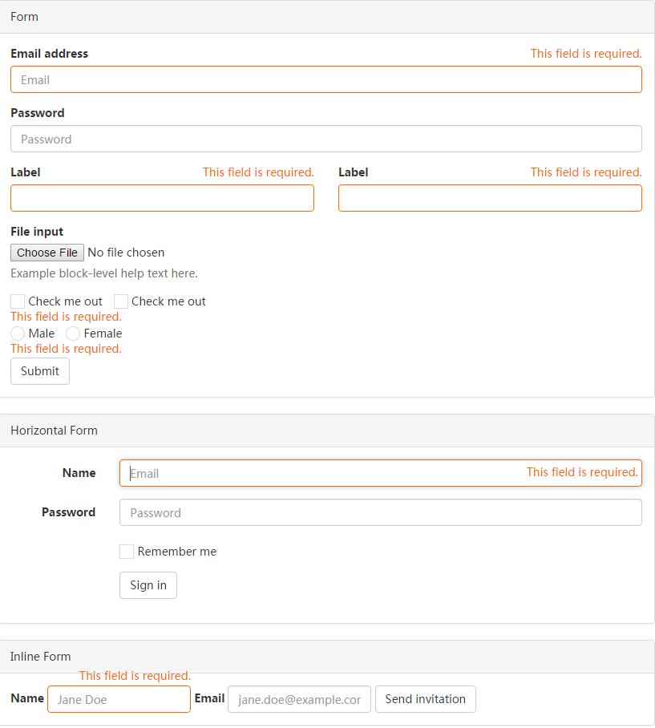

## jquery.checkall

Check all for `checkbox`.

Optional: [iCheck](https://github.com/fronteed/icheck), use `icheckAll` instead of `checkAll`.

### Example
```js
$('#chkAll').checkAll('.child', {
       inverse: true,  // true to reverse the checkbox, otherwise all or none
       end: function(){
           var checked = $(this).prop('checked');
           console.debug(checked ? 'Checked' : 'Unchecked');
       }
   });
```

## [Form & Validation (UI)](http://bndy.net/html/jquery.form.validation/index.html)

